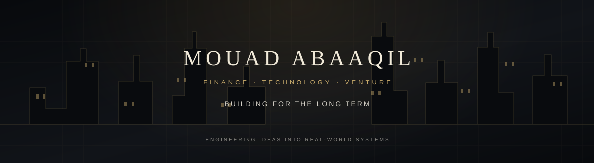

  
   
  <a href="https://abaaqil.me/">PORTFOLIO</a> &nbsp;·&nbsp;
  <a href="https://www.linkedin.com/in/mouad-abaaqil/">LINKEDIN</a> &nbsp;·&nbsp;
  <a href="mailto:abaaqilmouad@gmail.com">CONTACT</a>

## An entrepreneurial mindset. An engineer's toolkit.

I'm Mouad, a computer engineering student drawn to the world of finance, markets, and ambitious products. I approach technology with an operator's mindset: understand the problem, build the system, and make it useful in the real world.

My projects explore **fintech and investing**, **automated trading**, and **software for real-world operations**.

## Selected ventures

<table>
  <tr>
    <td width="50%" valign="top">
      
      <h3>ABQ-Banking</h3>
      
Portfolio management system — exploring the tools and interfaces behind personal finance.

      
<strong>FINANCE · PORTFOLIO MANAGEMENT</strong>

    </td>
    <td width="50%" valign="top">
      
      <h3>inoxtradebot</h3>
      
Trading platform with sentiment analysis, bringing market signals and automation together.

      
<strong>MARKETS · PYTHON · SENTIMENT ANALYSIS</strong>

    </td>
  </tr>
  <tr>
    <td width="50%" valign="top">
      
      <h3>Redline</h3>
      
Open-source freight tracker and black box for live location, ETA, theft detection, fleet relay, and last gasp.

      
<strong>LOGISTICS · REAL-TIME SYSTEMS</strong>

    </td>
    <td width="50%" valign="top">
      
      <h3>Water Quality Analysis</h3>
      
Data analysis and visualization of water quality indicators, developed during an internship at RAMSA.

      
<strong>DATA · ANALYTICS · IMPACT</strong>

    </td>
  </tr>
</table>

## The wider portfolio

<table>
  <tr>
    <td></td>
    <td></td>
  </tr>
  <tr>
    <td></td>
    <td></td>
  </tr>
  <tr>
    <td></td>
    <td><a href="https://github.com/mouad-abaaqil?tab=repositories">Explore all public repositories →</a></td>
  </tr>
</table>

## Investment & engineering dashboard

  
  

### Building over time

  

  Capital · Technology · Long-term thinking

